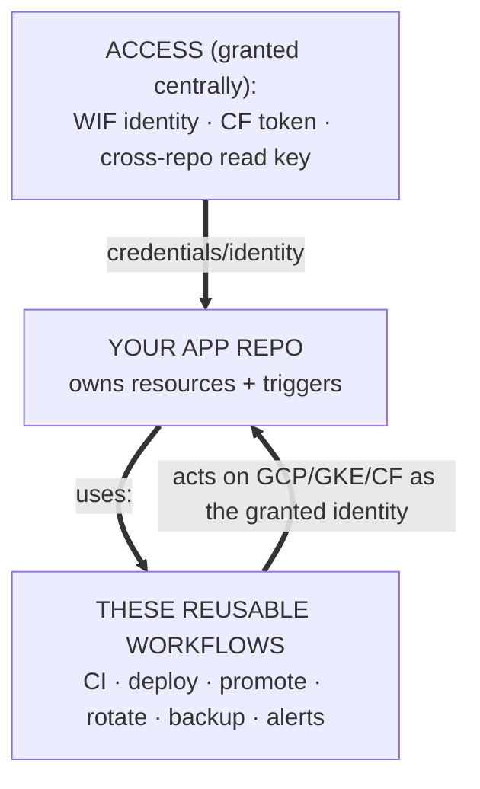
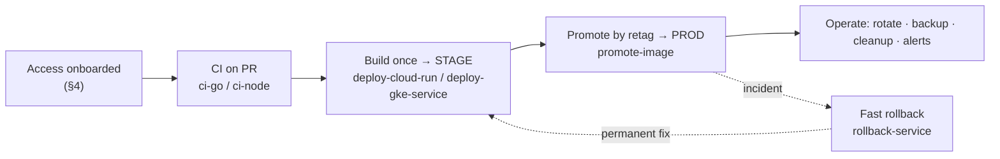

# Platform handbook — using these reusable workflows

How to run an app repo on the GCP (Cloud Run + GKE) + Postgres + Cloudflare platform these
workflows serve: the **access** your repo is granted, the **ops workflows** you call, and how
they connect end-to-end. Start here, then follow the links into each workflow's `docs/<name>.md`.

> **Audience:** maintainers wiring up CI, deploys, secret rotation, backups, alerts, and
> cross-repo access for an app repo.

---

## 1. Two kinds of thing you use

| | What | Where it comes from |
|---|---|---|
| **Access / identity** | Keyless GCP auth (WIF), Cloudflare deploy tokens, cross-repo read keys | Your org's **access-provisioning repo** (private, config-driven) — see [§4](#4-access-youre-granted-prerequisites) |
| **Ops bodies** | CI, build/deploy, promote, rotate, backup, cleanup, alerts | **This repo** — `workflow_call` bodies you invoke with `uses:` ([§5](#5-workflow-catalog)) |
| **Your resources** | APIs, secrets, pub/sub, alert *policies*, the services themselves | **Your app repo**, operated with the access above |

**The split:** access is granted centrally; you own your resources; these workflows are the
shared *ops bodies* you run against them. Nothing here bakes in a project value — every
project-specific input is a `workflow_call` input, and every secret is passed at call time.



---

## 2. End-to-end lifecycle



1. **Access onboarded** — a WIF foothold + a releaser SA with the roles your deploys need (§4).
2. **CI** — `ci-go` / `ci-node` on every PR/push.
3. **Build once → stage** — `deploy-cloud-run` / `deploy-gke-service` builds `image:<sha>`, rolls stage.
4. **Promote → prod** — `promote-image` **retags** the stage-proven digest to `:vX.Y.Z` and rolls. No rebuild — prod runs the identical bytes stage tested.
5. **Operate** — rotate secrets/keys, back up Postgres, sweep old images, apply alerts.
6. **Rollback** — `rollback-service` is the out-of-band incident bridge; the permanent fix is `git revert` → new linear tag through the promote path.

Full release model (trunk-based, build-once, promote-by-retag, forward-only, rollback fenced
out-of-band): **[release-process.md](release-process.md)**.

---

## 3. "I want to…" → use this

| I want to… | Use |
|---|---|
| Authenticate my CI to GCP without a stored key | WIF onboarding ([§4](#4-access-youre-granted-prerequisites)) |
| Read **another private repo's** code in my CI (>1 library) | Cross-repo reader-key ([§4](#4-access-youre-granted-prerequisites)) |
| Run Go / Node CI | [`ci-go`](ci-go.md) / [`ci-node`](ci-node.md) |
| Ship an image to Cloud Run / GKE | [`deploy-cloud-run`](deploy-cloud-run.md) / [`deploy-gke-service`](deploy-gke-service.md) |
| Promote a stage image to prod without rebuilding | [`promote-image`](promote-image.md) |
| Get a bad release off prod **fast** | [`rollback-service`](rollback-service.md) |
| Change a service's config / secret **values** | [`manage-config-secrets`](manage-config-secrets.md) (GKE) / [`sync-bundle-key`](sync-bundle-key.md) (Cloud Run) |
| Rotate JWT keys / a Worker HMAC / check a CF token | [`rotate-signing-keypair`](rotate-signing-keypair.md) / [`rotate-worker-signing-secret`](rotate-worker-signing-secret.md) / [`rotate-cloudflare-token`](rotate-cloudflare-token.md) |
| Deploy a static site to Cloudflare Pages | [`deploy-cloudflare-pages`](deploy-cloudflare-pages.md) |
| Back up Postgres | [`neon-backup`](neon-backup.md) |
| Reclaim Artifact Registry storage | [`cleanup-gar-images`](cleanup-gar-images.md) |
| Provision Cloud Monitoring alert policies | [`bootstrap-alerts`](bootstrap-alerts.md) |
| Deploy to EKS/AKS or a non-GAR registry (stored creds) | [`deploy-cluster-keyed`](deploy-cluster-keyed.md) |

---

## 4. Access you're granted (prerequisites)

These workflows *use* access minted by your org's central, config-driven access-provisioning
repo (private). You don't create it in your app repo — you reference it. Three patterns:

- **Keyless GCP (WIF) — the default.** Your project is onboarded (a service account + the IAM
  roles your deploys need + repo federation). Deploy workflows then pass `wif_provider` +
  `service_account` (resource identifiers, **not** secrets) and set
  `permissions: { id-token: write }`. No stored GCP keys — this is what makes every `deploy-*`
  / `rotate-*` / `neon-backup` call keyless.
- **Cloudflare deploy tokens.** A per-repo CF Pages token is minted centrally and written to
  your repo's `CLOUDFLARE_API_TOKEN` secret — consumed by [`deploy-cloudflare-pages`](deploy-cloudflare-pages.md).
- **Cross-repo private read (GitHub App reader-key).** When your CI must read **more than one
  private** framework/library repo, you don't use a PAT (user-bound) or deploy keys (one repo
  each). A shared org-owned **reader GitHub App** (`contents:read`, installed on the provider
  repos) has its key distributed into your repo's `LIB_READER_APP_KEY` secret +
  `LIB_READER_APP_ID` variable; your build mints its own short-lived token:

  ```yaml
  - uses: actions/create-github-app-token@<sha>
    id: reader
    with:
      app-id: ${{ vars.LIB_READER_APP_ID }}
      private-key: ${{ secrets.LIB_READER_APP_KEY }}
      owner: <provider-org>
      repositories: lib-a,lib-b        # only what THIS build imports
  - run: |
      git config --global \
        url."https://x-access-token:${{ steps.reader.outputs.token }}@github.com/".insteadOf \
        "https://github.com/"
      go build ./...                   # with GOPRIVATE=github.com/<org>/*
  ```

---

## 5. Workflow catalog

Call with `uses: <org>/reusable-workflows/.github/workflows/<name>@vX.Y.Z`. Each links to its
full input/secret contract. Grant `id-token: write` for any WIF workflow. Cross-org callers
**cannot** use `secrets: inherit` — pass each secret explicitly.

### CI
- **[`ci-go`](ci-go.md)** — Go: build · vet · test · golangci-lint + caching; optional coverage gate + postgres/mysql/redis service containers. *Auth: none* (optional `go_private_token` for private modules — must **not** be named `github_token`). With `enable_services=true`, tests run in the `go-db` job.
- **[`ci-node`](ci-node.md)** — Node/React: install · lint · test · build + caching; commands overridable (npm/yarn/pnpm). *Auth: none.* `enable_corepack` for pnpm.

### Build & deploy
- **[`deploy-cloud-run`](deploy-cloud-run.md)** — build → push (GAR) → roll **Cloud Run**. Modes: `update-image` (image flip, safest default) or `deploy` (full). Keys: `gcp_project`, `wif_provider`, `service_account`, `gar_repo`, `image_name`, `service`. *Auth: WIF.* `update-image` flips only the image — env/scale/SA owned elsewhere.
- **[`deploy-gke-service`](deploy-gke-service.md)** — build → push → roll a **GKE** workload (kubectl/helm). Keys: `gar_repo`, `image_name`, `wif_provider`, `service_account`, `cluster_*`, `namespace`, `svc_name`. *Auth: WIF.* Config/secret **values** are managed separately (`manage-config-secrets`).
- **[`promote-image`](promote-image.md)** — server-side **retag** (`:<sha>`→`:vX.Y.Z`, no rebuild) then optionally roll. Keys: `gcp_region`, `gar_project`, `gar_repo`, `image_name`, `source_tag`, `deploy_target`. *Auth: WIF preferred; key-based fallback.* The forward-only prod path — **not** for rollbacks.
- **[`rollback-service`](rollback-service.md)** — roll a service **back** onto a prior image (tag/digest, no rebuild). Keys: `deploy_target` + exactly one of `rollback_tag`/`rollback_digest`. *Auth: WIF preferred.* Outside the promote flow; pass `commit_sha` so forward-only stays accurate.
- **[`deploy-cluster-keyed`](deploy-cluster-keyed.md)** — **key-based**, multi-cloud (GKE/EKS/AKS/kubeconfig) + multi-registry (GAR/ECR/ACR/GHCR/…). *Auth: stored `cluster_credentials` (+ optional `registry_credentials`).* Use **only** when keyless isn't possible; rotate those keys.
- **[`deploy-cloudflare-pages`](deploy-cloudflare-pages.md)** — build a static site → Cloudflare Pages. Keys: `project_name`, `account_id`. *Secret: `cloudflare_api_token`* (§4). Skips bot-authored pushes.

### Secrets & rotation
- **[`manage-config-secrets`](manage-config-secrets.md)** — write a **GKE** service's config (dotenv → ConfigMap, `keyvalue`/`react-env-js`) and/or secrets (`k8s` / `gsm`). *Secret: `payload_json`* (masked `toJSON()`); *Auth: WIF or stored `cluster_credentials`.* Values only — no deploy, no pod wiring.
- **[`sync-bundle-key`](sync-bundle-key.md)** — upsert key(s) into a Secret Manager **bundle** → roll Cloud Run → disable old version. *Secret: `payload_json` {DEST_KEY:value}.* **Ordering contract:** old version disabled only after **every** service rolls.
- **[`rotate-signing-keypair`](rotate-signing-keypair.md)** — fresh RS256 JWT keypair into a bundle → roll → disable old. *Auth: WIF.* **No grace window** — don't use if verifiers cache one key with no `kid`.
- **[`rotate-worker-signing-secret`](rotate-worker-signing-secret.md)** — zero-downtime HMAC rotation shared by a CF Worker + Cloud Run, via a PRIMARY/PREVIOUS grace window. *Secret: `cloudflare_api_token`.* `grace_seconds` must exceed your longest signed-URL TTL.
- **[`rotate-cloudflare-token`](rotate-cloudflare-token.md)** — **verify/nag only** (does not mint): checks the CF token is active, prints a runbook. *Secret: `cloudflare_api_token`.* Rotation is manual by design.

### Backup · cleanup · alerts
- **[`neon-backup`](neon-backup.md)** — `pg_dump` a Postgres DB → private artifact + sha256 manifest. Keys: `db_host`, `db_user`, `db_name`. *Auth: WIF; DB password read from a Secret Manager bundle.* `pg_major` ≥ server major; provider PITR is still the stronger DR story.
- **[`cleanup-gar-images`](cleanup-gar-images.md)** — age-sweep GAR, protecting live Cloud Run Service **and** Job digests + recent semver + `keep_tags`. *Auth: WIF.* **`dry_run` defaults true** — run the plan first; aborts if zero live digests resolve.
- **[`bootstrap-alerts`](bootstrap-alerts.md)** — apply a Monitoring channel + alert policies from **your** repo's `infra/alerts/`. *Auth: WIF.* Idempotent by `displayName`; `force_update` is destructive.

---

## 6. Worked example — a full app repo

Two workflows in *your* repo wire the whole pipeline. Pin an exact release tag (check Releases
for the latest; `v1.11.0` shown).

```yaml
# .github/workflows/ci.yml
name: CI
on: [push, pull_request]
permissions: { contents: read }
jobs:
  ci:
    uses: <org>/reusable-workflows/.github/workflows/ci-go.yml@v1.11.0
    with: { go_version_file: go.mod, coverage_threshold: 50 }
```

```yaml
# .github/workflows/release.yml
name: Release
on:
  push:
    branches: [development]        # stage
    tags: ['v*.*.*']              # prod
permissions: { contents: read, id-token: write }   # id-token: write ⇒ keyless WIF
jobs:
  stage:
    if: github.ref == 'refs/heads/development'
    uses: <org>/reusable-workflows/.github/workflows/deploy-cloud-run.yml@v1.11.0
    with:
      gcp_project: my-project
      wif_provider: ${{ vars.GCP_WIF_PROVIDER }}     # from access onboarding (§4)
      service_account: ${{ vars.GCP_RELEASER_SA }}
      gar_repo: backend
      image_name: api
      service: api-stage
  prod:
    if: startsWith(github.ref, 'refs/tags/v')
    uses: <org>/reusable-workflows/.github/workflows/promote-image.yml@v1.11.0
    with:
      gcp_region: asia-southeast1
      gar_project: my-project
      gar_repo: backend
      image_name: api
      source_tag: ${{ github.sha }}
      deploy_target: cloud-run
```

Plus scheduled ops (each is `workflow_call`, so **you** own the `schedule`): `neon-backup`
nightly, `cleanup-gar-images` weekly (`dry_run` first), `bootstrap-alerts` on push to
`infra/alerts/`, `rotate-*` on their cadence.

---

## 7. Versioning & pinning (non-negotiable)

- **Pin an exact `vX.Y.Z` tag.** Releases are immutable — a fix here can't change your prod ops behind your back. **Never `@main`.**
- **`v1` is a frozen legacy alias** — don't pin new callers to it; it lacks later workflows.
- **Semver tracks the input contract** — a new required input / removed input / changed default / behaviour change on a destructive path is a **major** bump. Read the [DECISIONS.md](../DECISIONS.md) entry before upgrading.

---

## 8. Security conventions

- **Keyless by default** (WIF); stored keys are confined to `deploy-cluster-keyed` and the documented Cloudflare/GitHub distributor credentials.
- **App, not PAT** for cross-repo access and secret distribution — org-owned GitHub Apps (offboarding-safe, fine-grained), not user PATs.
- **Third-party actions SHA-pinned** (version in a trailing comment) — these mint cloud creds and dump databases; a moved tag is a supply-chain event. CI enforces it.
- **Every `run:` is `shell: bash`** (to get `-eo pipefail`).
- **Destructive workflows take `dry_run`** and default it safe — plan, read, apply.
- **No secrets committed** — callers pass every secret at call time.

See the [README](../README.md) for the full conventions and the per-workflow `docs/<name>.md`
pages for exact input/secret contracts.
